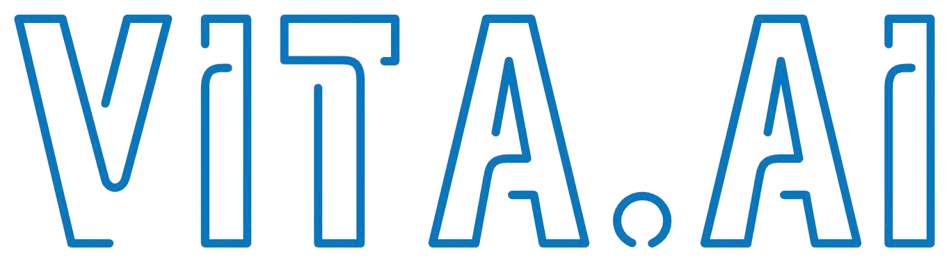
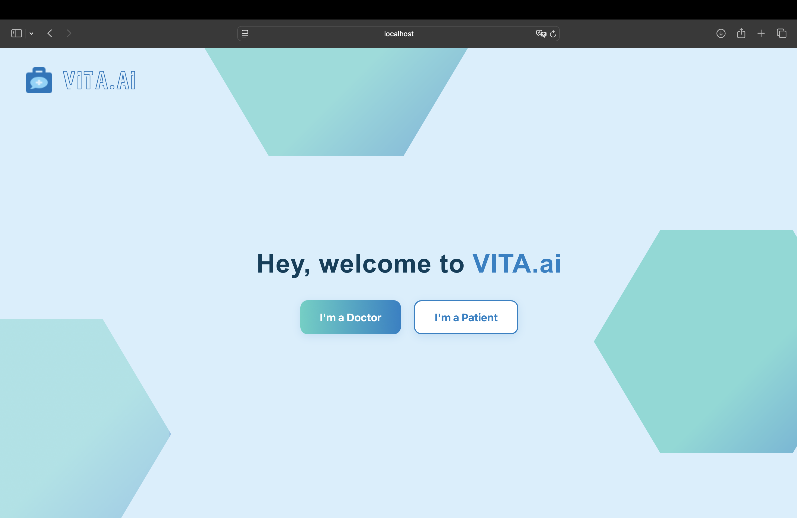
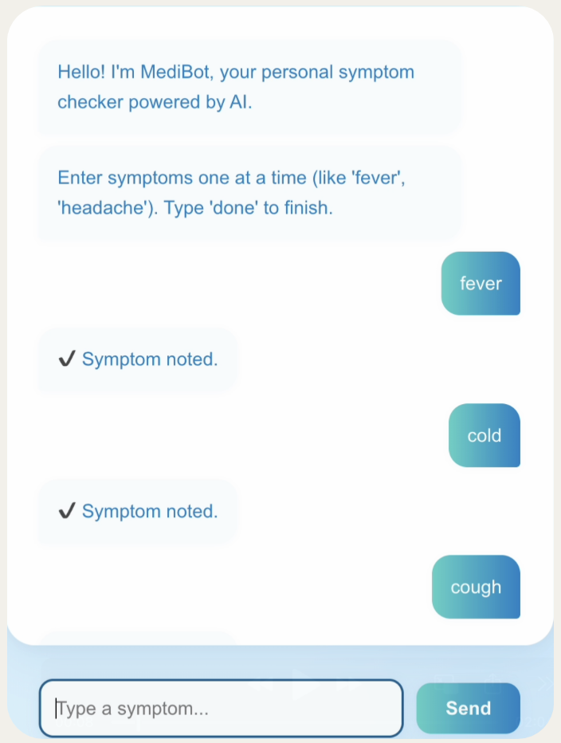
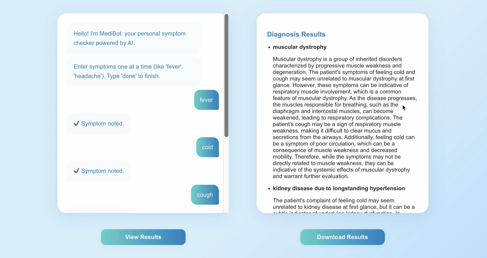
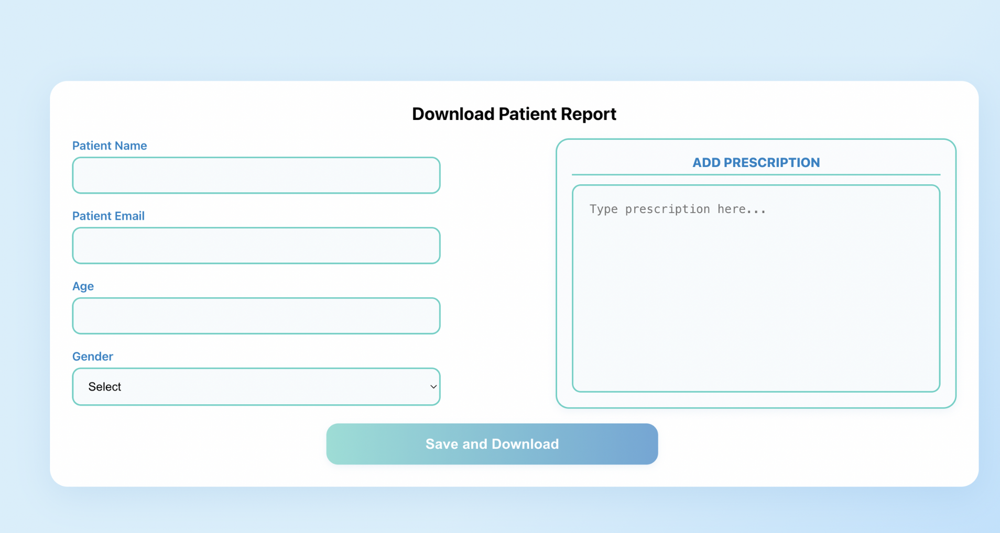

<p align="center"></p>

# VitaAI –– NeuroMechs

---

## 📝 Brief Overview

VitaAI is an AI Assisted medical assistant intended for the use of doctors. It helps in predicting top 10 diseases a person might be suffering from based on the input symptoms and also provide a crystal clear, medically relevant reasoning which made it reach the conclusion it reached. It is simple, easy to use, and trustworthy medical assistant for doctors, just what a junior doctor would write for you. 

---

## 📸 Screenshots of the Web Demo

<p align="center">
    
    <br> <br>
    <em>Fig: Landing Page on the Start of the Website</em>
</p>
<p align="center"> 
    
    <br> <br>
    <em>Fig: Symptom Input</em>
</p>
<p align="center"> 
    
    <br> <br>
    <em>Fig: Sample of Result Generated</em>
</p>
<p align="center"> 
    
    <br> <br>
    <em>Fig: Page to add Prescription</em>
</p>

---

## 📚 Tech Stack
<p align="center">
    
    
    
    
    
    
    
</p>

--- 

## 🧠 Backend Walkthrough
- **Symptom Selection :** Dynamically enter the patient's symptoms from the frontend in form of an interactive chatbot.
- **Career Picker :** DNN models specific to each cluster finds most suitable jobs from each cluster. 
- **SHAP Explainer :** A SHAP model derives the list of all the factors that contributed positively/negatively to prediction.
- **IBM WatsonX API :** Reads the SHAP generated explanations and creates a detailed human readable report about why career was chosen.

---

## Getting Started

### 🔧 Prerequisites
- Python v3.10 (No other version would be able to run the PyTorch properly)
- NodeJS v22.0.0+
- npm v10.0.0+

### 🖥️ Local Setup
#### Repository Cloning
``` bash
git clone https://github.com/Vishesh-Goyal7/NeuroMechs
cd NeuroMechs
```

#### 🏕️ Vitual Environment Setup
```bash
python3.10 -m venv venv  #(Do this in the root directory)
source venv/bin/activate
pip install -r requirements.txt
```

#### Backend Setup
```bash
cd backend
npm install  

**Create a .env file with PORT=6969, a JWT_SECRET, a HF_TOKEN(hugging face token), MONGO_URI and your IBM_API_KEY, IBM_SERVICE_URL and IBM_PROJECT_ID**

node index.js
```

#### Frontend Setup
```bash
cd ../frontend
npm install
npm start
```

---

## 📃 License

MIT License © 2025 Team NeuroMechs

---

## Live Demo 

[Live Demo](https://vitaai.neuromechs.in)

## 📝 Final Note

This project represents months of engineering, experimentation, grit, determination, and perseverance. If VitaAI helped you, inspired you, or made you think — we’d love to hear from you.

Feel free to ⭐ the repo or connect with us. 

Stay curious.

---

## 🙋‍♀️🙋‍♂️ Authors 

**Tanishta**
[LinkedIn](https://www.linkedin.com/in/tanishta-b1116b255) | [Mail](tanishtak15@gmail.com) | [GitHub](https://github.com/Tanishta15)

**Saketh Pradyumna**
[LinkedIn](https://www.linkedin.com/in/saketh-pradyumna-3b3b0b264) | [Mail](parasarampradyumna@gmail.com) | [GitHub](https://github.com/pradyumna4)

**Vishesh (That's me 👋)**
[Mail](visheshvishu1@outlook.com) | [Portfolio](https://visheshverse.com) | [GitHub](https://github.com/Vishesh-Goyal7) | [LinkedIn](https://www.linkedin.com/in/vishesh-goyal-2k5)